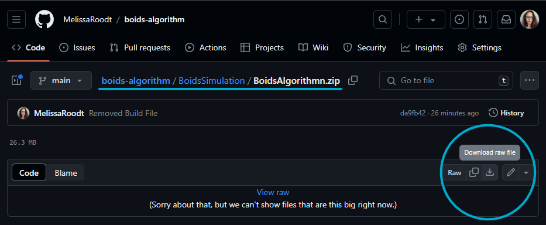
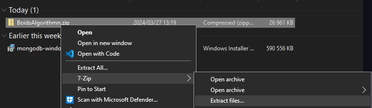
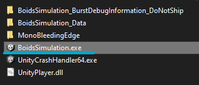

# boids-algorithm
Implementation of Boids algorithm using the Unity Game Engine. Boids algorithm, introduced by Craig Renolds in 1987, has become a foundational method for simulating collective behaviour in computer graphics and swarm intelligence research. Inspired by the swarming of birds it implements three basic rules to achieve a complicated flight pattern.

# Video of Project
[Watch the video](https://youtu.be/a6eu54CsfB8)

# How to Download
1. Go to the path: boids-algorithm/BoidsSimulation/BoidsAlgorithmn.zip
2. Click on the download button

3. Extract the .zip file

4. Run the BoidsAlgorithm.exe

